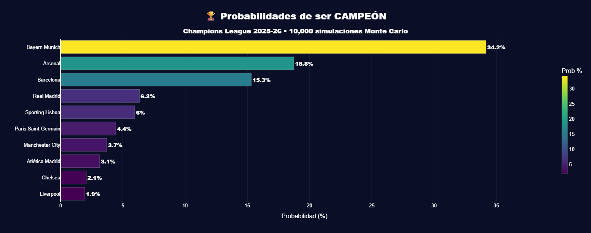
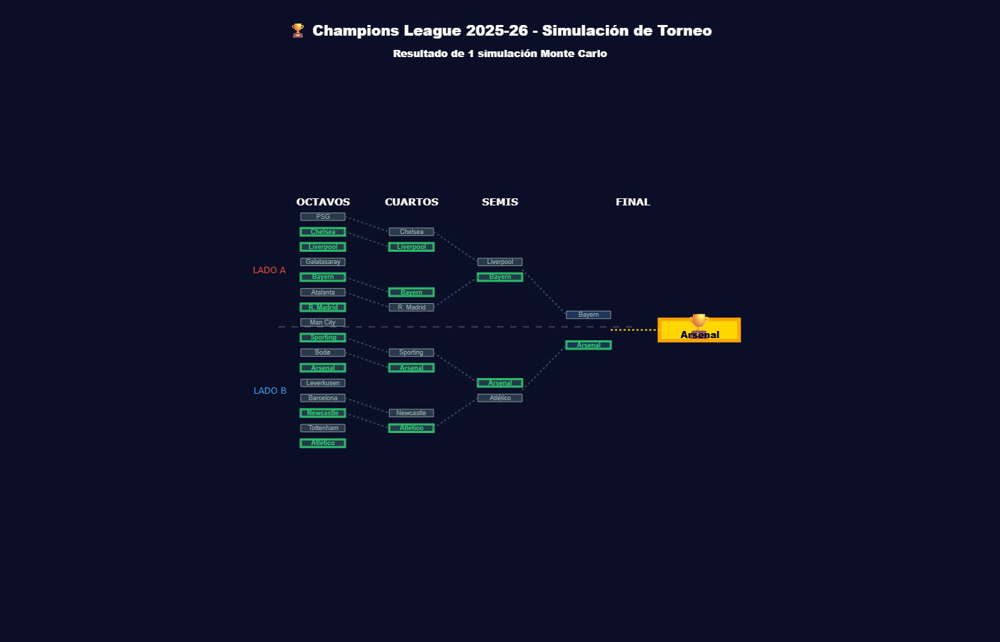
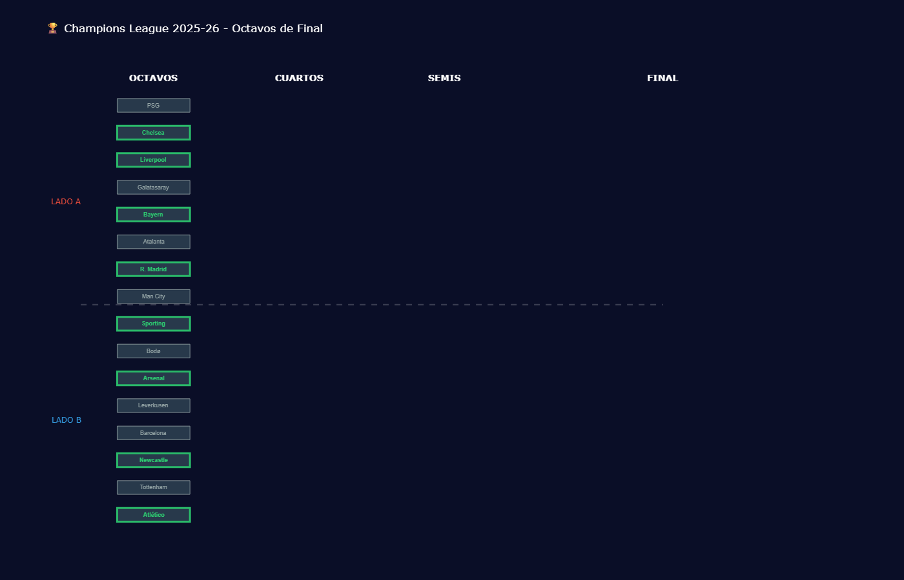
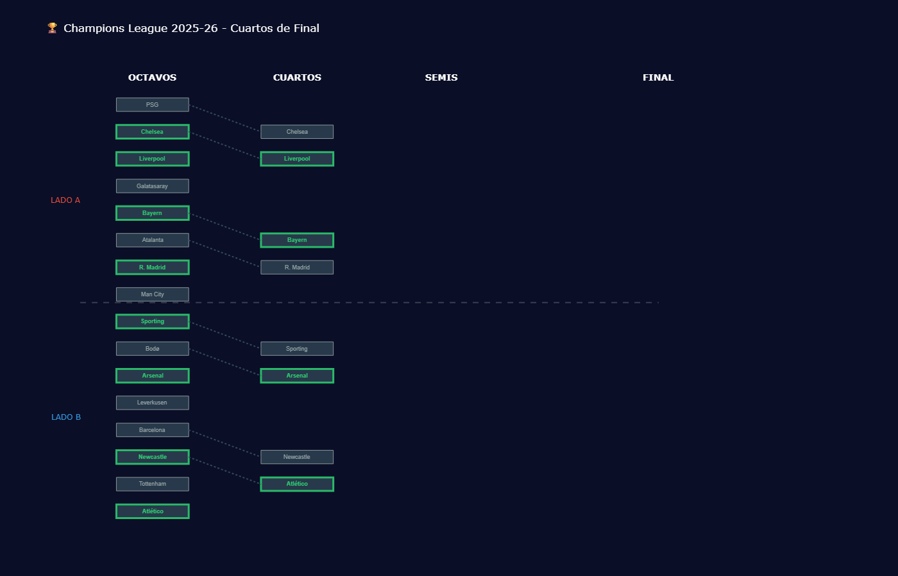
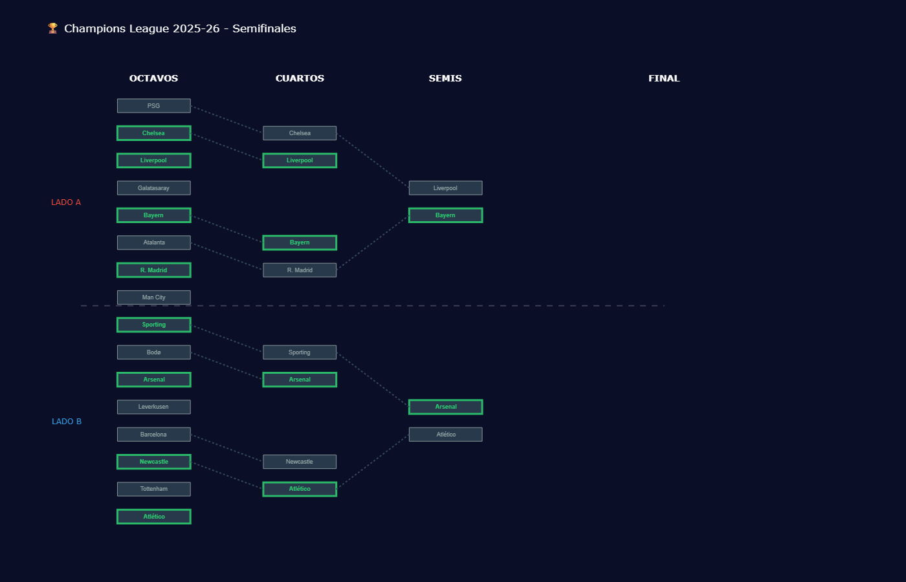
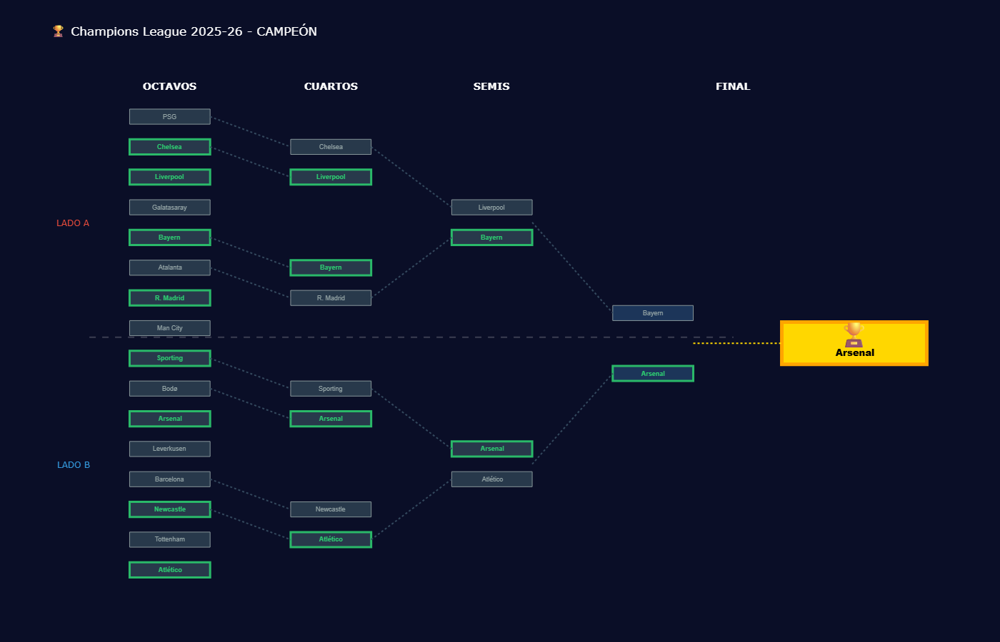

# ⚽ Champions League Predictor 2025-26

**Simulador probabilístico de Champions League** basado en estadísticas reales de temporada y simulación Monte Carlo.

[](https://www.python.org/)
[](https://pandas.pydata.org/)
[](https://plotly.com/)
[](LICENSE)

> *"¿Supercomputadora? No. Solo Python, datos y 10,000 simulaciones."*

---

## 🎯 ¿Qué es esto?

Un modelo probabilístico que simula **10,000 torneos completos** de Champions League para calcular qué equipo tiene más chances de ser campeón.

**No es una bola de cristal.** Es una aproximación basada en datos reales de la temporada 2025-26.

---

## 📊 Resultados Principales

### 🏆 Probabilidades de Campeón



**Top 3 Favoritos:**
- **Bayern Munich:** 34.2%
- **Arsenal:** 18.8%
- **Barcelona:** 15.3%

Los 3 favoritos concentran **68.3%** de la probabilidad total.

---

## 🌳 Ejemplo de Simulación

Resultado de 1 simulación completa de las 10,000 ejecutadas:

### Bracket Completo



### Progresión del Torneo

#### Octavos de Final


#### Cuartos de Final


#### Semifinales


#### Final y Campeón


> *Cada simulación tiene un resultado diferente. El modelo ejecuta 10,000 simulaciones para calcular probabilidades.*

---

## 🔬 Metodología

### 1️⃣ Power Rating

Construcción de rating basado en estadísticas de temporada:

```
Power Score = 
  30% × Points per game (liga ajustado por nivel)
+ 25% × Goal difference per game (liga ajustado)
+ 15% × Goals scored per game (liga ajustado)
+ 10% × Defensive score (liga ajustado)
+ 15% × Champions League PPG
+ 5% × Champions League GD
```

**🔑 Innovación clave:** Ajuste por nivel de liga

Las estadísticas de liga doméstica se ajustan según nivel de competencia:

| Liga | Multiplicador | Razón |
|------|---------------|-------|
| Premier League | 1.00x | Liga más competitiva (referencia) |
| La Liga | 0.95x | Segunda más fuerte |
| Bundesliga | 0.93x | Alta competitividad |
| Serie A | 0.90x | Competitiva |
| Ligue 1 | 0.85x | Nivel medio-alto |
| Primeira Liga | 0.70x | Dominio de top 3 |
| Süper Lig | 0.65x | Nivel medio |
| Eliteserien | 0.50x | Liga nórdica |

Esto evita que equipos dominantes en ligas débiles sean sobrevalorados.

### 2️⃣ Modelo de Probabilidad

Probabilidad de victoria usando fórmula tipo ELO:

```python
P(A gana) = 1 / (1 + 10^((Rating_B - Rating_A) / 400))
```

### 3️⃣ Simulación Monte Carlo

**Para cada una de las 10,000 simulaciones:**

1. **Octavos de final** - Ida y vuelta con regla de gol visitante
2. **Cuartos de final** - Respetando bracket fijo de la UEFA
3. **Semifinales** - Dos eliminatorias
4. **Final** - Partido único

**Resultado:** `Probabilidad de campeón = (veces que ganó) / 10,000`

---

## 🏗️ Estructura del Proyecto

```
champions-predictor/
├── data/
│   ├── raw/
│   │   └── team_stats_2024_25.csv          # Stats recopiladas manualmente
│   └── processed/
│       ├── power_ratings_final.csv         # Ratings calculados
│       └── probabilidades_campeon.csv      # Resultados finales
├── notebooks/
│   ├── 01_power_rating_CORREGIDO.ipynb     # Cálculo de ratings
│   ├── 02_simulacion_monte_carlo.ipynb     # Simulación 10k torneos
│   ├── 03_visualizaciones_finales.ipynb    # Gráficos básicos
│   └── 04_visualizaciones_PRO.ipynb        # Visualizaciones avanzadas
├── src/
│   ├── equipos_octavos.py                  # Datos de enfrentamientos
│   ├── generar_graficos_cool.py            # Gráficos mejorados
│   └── generar_secuencia_bracket.py        # Brackets progresivos
├── visualizations/                          # Gráficos guardados (PNGs)
│   ├── probabilidades_campeon.png
│   ├── bracket_simulacion.png
│   ├── bracket_1_octavos.png
│   ├── bracket_2_cuartos.png
│   ├── bracket_3_semis.png
│   └── bracket_4_final.png
├── README.md
├── requirements.txt
└── .gitignore
```

---

## 🚀 Instalación y Uso

### Requisitos

- Python 3.13+
- Jupyter Notebook

### Setup

```bash
# Clonar repositorio
git clone https://github.com/JavierGuerra13/champions-predictor.git
cd champions-predictor

# Crear entorno virtual
python -m venv venv

# Activar entorno virtual
# Windows:
venv\Scripts\activate
# Mac/Linux:
source venv/bin/activate

# Instalar dependencias
pip install -r requirements.txt
```

### Ejecutar Simulación

```bash
# Abrir Jupyter
jupyter notebook

# Ejecutar notebooks en orden:
# 1. 01_power_rating_CORREGIDO.ipynb    (Calcula ratings)
# 2. 02_simulacion_monte_carlo.ipynb     (Simula 10k torneos - tarda 2-3 min)
# 3. 03_visualizaciones_finales.ipynb    (Genera gráficos básicos)
# 4. 04_visualizaciones_PRO.ipynb        (Opcional - gráficos avanzados)
```

**Tiempo total estimado:** 10-15 minutos

---

## 📈 Visualizaciones Interactivas

Además de los PNGs mostrados arriba, el proyecto genera visualizaciones interactivas en HTML:

- **Heatmap de Enfrentamientos** - Matriz de probabilidades entre equipos
- **Sankey Diagram** - Flujo de probabilidades por ronda
- **Radar Chart** - Comparación multidimensional Top 5
- **Treemap** - Concentración de probabilidades
- **Bubble Chart 3D** - Rating vs Probabilidad vs Performance

*Estos archivos HTML son interactivos (hover, zoom) pero no están en el repositorio por su tamaño. Se generan al ejecutar los notebooks.*

---

## 🎲 Limitaciones del Modelo

### ❌ Este modelo NO incluye:

- **Lesiones y suspensiones** - Cambios de última hora que afectan el rendimiento
- **Forma reciente** - Dinámicas específicas de los últimos 5-10 partidos
- **Experiencia en Champions** - Historial y "know-how" del torneo
- **Valor de mercado** - Calidad individual de las plantillas
- **Factor psicológico** - Presión, motivación, momentum del equipo
- **Táctica del entrenador** - Estilos de juego y adaptaciones estratégicas
- **Factor local** - Ventajas específicas de jugar en casa (clima, afición, etc.)

### ✅ Solo se basa en:

- Estadísticas de liga doméstica temporada 2025-26
- Estadísticas de Champions League (fase de grupos)
- Ajuste por nivel de competencia de cada liga
- Simulación probabilística Monte Carlo

**Conclusión:** Es un modelo **simplificado con fines educativos y de portafolio**, no una predicción profesional. El fútbol es impredecible, y eso es lo que lo hace emocionante.

---

## 🛠️ Tecnologías Utilizadas

- **Python 3.13** - Lenguaje principal
- **Pandas** - Manipulación y análisis de datos
- **NumPy** - Operaciones numéricas y cálculos
- **Plotly** - Visualizaciones interactivas
- **Jupyter Notebook** - Desarrollo y documentación interactiva

---

## 📊 Fuentes de Datos

**Estadísticas recopiladas manualmente de:**
- [FBref](https://fbref.com/) - Stats detalladas de ligas domésticas
- [FBref Champions League](https://fbref.com/en/comps/8/Champions-League-Stats) - Stats de fase de grupos

**Fecha de recopilación:** Marzo 9, 2026 (antes del inicio de octavos de final)

**Datos incluyen:**
- Partidos jugados, puntos, goles a favor/contra por equipo
- Stats de liga doméstica (hasta jornada 25-30 según liga)
- Stats de Champions League fase de grupos completa

---

## 🧪 Validación Post-Torneo

*Sección a actualizar después de los partidos*

Una vez finalicen los octavos de final (18-19 marzo), actualizaré esta sección con:

- ✅ Comparación predicción vs realidad
- ✅ Análisis de aciertos y errores del modelo
- ✅ Qué factores no capturó el modelo
- ✅ Aprendizajes y posibles mejoras

---

## 🔮 Roadmap - Próximas Mejoras

- [ ] **v2.0:** Incorporar datos de lesiones de jugadores clave
- [ ] **v2.1:** Factor forma reciente (últimos 5 partidos con más peso)
- [ ] **v2.2:** Scraping automático de estadísticas en tiempo real
- [ ] **v2.3:** Dashboard interactivo con Streamlit o Dash
- [ ] **v2.4:** Predicciones por partido individual con intervalos de confianza
- [ ] **v2.5:** API REST para consultar probabilidades
- [ ] **v3.0:** Modelo de machine learning (XGBoost/Random Forest) para mejorar predicciones

---

## 📝 Cómo Contribuir

¿Encontraste un bug o tienes una idea para mejorar el modelo?

1. **Fork** el repositorio
2. **Crea** una rama para tu feature (`git checkout -b feature/MejoraPredictiva`)
3. **Commit** tus cambios (`git commit -m 'Agrega factor experiencia Champions'`)
4. **Push** a la rama (`git push origin feature/MejoraPredictiva`)
5. **Abre** un Pull Request

---

## 👤 Autor

**Javier Guerra**

- 🐙 GitHub: [@JavierGuerra13](https://github.com/JavierGuerra13)
- 🐦 X (Twitter): [@JavierAnaliza](https://twitter.com/JavierAnaliza)
- 💼 LinkedIn: [Javier Guerra](https://linkedin.com/in/javier-guerra)
- 📧 Email: [tu-email@ejemplo.com]

---

## 📝 Licencia

Este proyecto está bajo la Licencia MIT - ver el archivo [LICENSE](LICENSE) para más detalles.

Eres libre de usar, modificar y distribuir este código con los créditos apropiados.

---

## 🙏 Agradecimientos

- **FBref** por proporcionar estadísticas detalladas y públicas
- **Comunidad de Python** por las increíbles librerías open-source
- **ChatGPT y Claude AI** por el apoyo en desarrollo y debugging
- **Comunidad de r/datascience** por inspiración y feedback

---

## ⚽ Disclaimer

Este es un **proyecto educativo y de portafolio** creado con fines de aprendizaje en ciencia de datos y programación.

Las probabilidades calculadas son estimaciones basadas en un modelo simplificado y **NO deben ser utilizadas** para:
- ❌ Apuestas deportivas
- ❌ Decisiones financieras
- ❌ Asesoramiento profesional

El fútbol es inherentemente impredecible. Los mejores equipos pueden perder, los underdogs pueden ganar, y eso es precisamente lo que hace al deporte emocionante.

**Disfruta del fútbol de manera responsable.** ⚽❤️

---

## 📊 Estadísticas del Proyecto

- **Líneas de código:** ~2,500
- **Simulaciones ejecutadas:** 10,000
- **Tiempo de ejecución:** ~3 minutos
- **Equipos analizados:** 16
- **Partidos simulados:** 15 por torneo × 10,000 = 150,000 partidos
- **Datos procesados:** 16 equipos × 8 variables × 10,000 iteraciones = 1.28M puntos de datos

---

**⭐ Si este proyecto te resultó útil o interesante, dale una estrella en GitHub!**

**🐛 ¿Encontraste un bug? Abre un issue.**

**💡 ¿Tienes ideas para mejorar el modelo? Los Pull Requests son bienvenidos!**

---

<p align="center">
  <i>Hecho con ❤️, ☕ y Python</i>
</p>

<p align="center">
  <i>"El fútbol es impredecible. Por eso lo amamos."</i>
</p>
